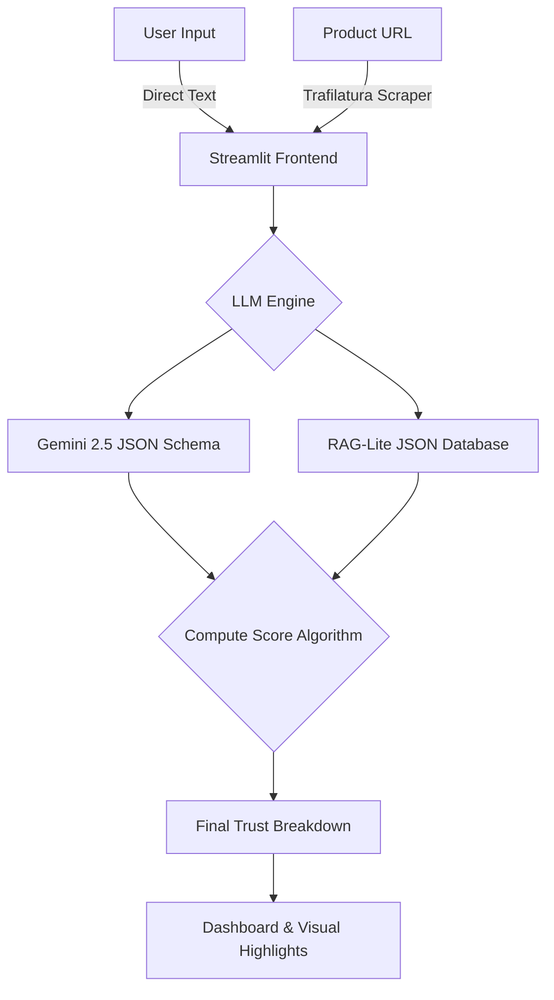

# 🌿 Green-Truth Auditor

**Instantly detect greenwashing and evaluate the true sustainability of any product or brand.**

Built for speed, transparency, and impact, the **Green-Truth Auditor** exposes misleading "eco-friendly" marketing fluff and rewards evidence-based sustainability claims using state-of-the-art LLM reasoning, RAG-lite verification, and a deterministic algorithmic Trust Breakdown.

---

## 🧠 How It Works: The Execution Pipeline

The Green-Truth Auditor isn't just a simple LLM wrapper. It uses a hybrid reasoning system:

1. **Extraction:** Evaluates text provided via direct input or scraped in real-time from a product URL using `trafilatura`.
2. **LLM Few-Shot Analysis:** The `gemini-2.5-flash` model parses the text to natively extract "Vague terms" (fluff) and "Strong terms" (certifications). It assigns a baseline categorization.
3. **RAG-Lite Verification:** We intercept the LLM output and check the raw text against our local `data/certifications.json` database. If the product claims "FSC" or "B-Corp", we verify that string natively and inject the official definition into the UI.
4. **Deterministic Scoring (SCORE_CONFIG):** We override the LLM's hallucinated scoring with a strict, transparent mathematical matrix. Points are rewarded for `Numbers` and `Certifications`, while heavily penalized for `Vague Claims` and `Lack of Evidence`.
5. **UI Rendering:** Streamlit visualizes the outcome in a beautiful 7-factor ✅/❌ grid, highlighting exactly which buzzwords triggered the algorithm.

---

## 🏗️ System Architecture



---

## ✨ Key Features

- **Dual Input Modes:** Paste marketing copy directly or provide a URL (automatically scraped and parsed).
- **RAG-Lite Verification Engine:** We don't just rely on LLMs. The system actively cross-references text against a local database (`data/certifications.json`) of verified standards (like FSC, GOTS, B-Corp) to mathematically boost trust scores.
- **7-Factor Trust Breakdown:** A granular UI grid showing exactly *why* a product got its score, analyzing:
  - ✅ Certifications, Measurable Data, Supply Chain transparency, Third-Party Audits, and Lifecycle data.
  - ❌ Vague Claims (e.g., "planet-friendly") and Lack of Evidence.
- **Explainability First:** Highlights specific buzzwords in the parsed text and injects the verifiable definitions of found certifications directly into the results.
- **Hackathon Bulletproof:** Built-in fallback heuristics ensure the UI and demo stay perfectly functional even if API keys drop or rate limits engage.
- **Built-in Dataset Evaluation:** Includes `evaluate.py` to benchmark the engine strictly against 50 samples from the `Emanuse/greenwashing` HuggingFace dataset.

---

## 🚀 Quickstart

### 1. Installation
Clone the repo and install dependencies:
```bash
git clone https://github.com/Jagdish1123/Green-Truth-Auditor.git
cd Green-Truth-Auditor
pip install -r requirements.txt
```

### 2. Configuration
Create a `.env` file in the root directory and add your Google Gemini API key:
```env
GEMINI_API_KEY=your_actual_api_key_here
```
*(Note: If the key is missing or invalid, the app automatically drops into a smart offline demo mode!)*

### 3. Run the App
Launch the Streamlit dashboard:
```bash
streamlit run app.py
```

---

## 🔬 Dataset Evaluation Suite
Prove the architecture's accuracy by running the headless dataset evaluation tool. This script seamlessly downloads the `Emanuse/greenwashing` dataset and runs a 50-sample evaluation loop.

```bash
python evaluate.py
```
This generates a strict predicted matrix in the terminal and saves any mismatch edge cases to `eval_failures.json` for prompt debugging.

---

## 🛠️ Built With & Tech Stack
* **Frontend/UI:** Streamlit
* **AI Engine:** Google Gemini (`gemini-2.5-flash`) via `google-genai`
* **Scraping:** Trafilatura
* **Data Sources / Testing:** `Emanuse/greenwashing` (Hugging Face Datasets)
* **Under the Hood:** Python, Pydantic, JSON Schema
